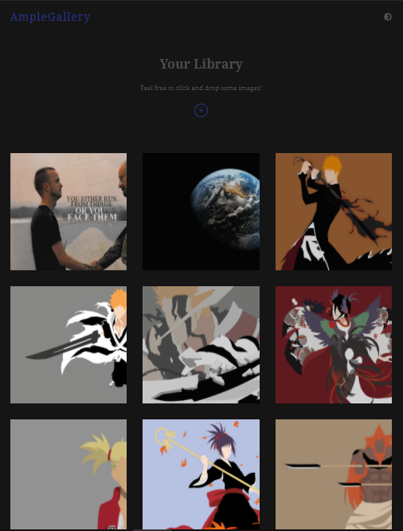

<!-- Please update value in the {}  -->

<h1 align="center">AMPLE-GALLERY</h1>

  <h3>
    <a href="https://photogallery-app-22dd2.web.app/">
     >> Demo <<
    </a>   
  </h3>

<!-- OVERVIEW -->

<h2 align="center">Overview</h2>

### About
  A Dynamic photo galley app. 

### Built With

<!-- This section should list any major frameworks that you built your project using. Here are a few examples.-->

- REACT
- Google FIREBASE

## Contact

- Website [ScriptoPlankton](https://sandeep.netlify.app/)
- GitHub [@sandeepashok](https://github.com/sandeepashok)

